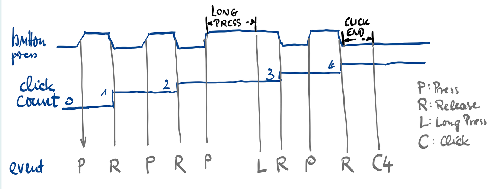
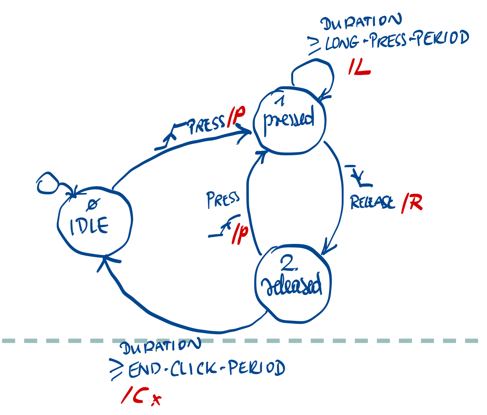

# Button_Handler

V2.0.0
  - Supports blocking and non-blocking mode.
  - Dependency to action-repeater removed.

  - generated button events :

  - internal states:


## Install
```
jag pkg install button_handler
```

## examples 

See the `examples` folder for examples.

## Features and bugs

Please file feature requests and bugs at the [issue tracker][tracker].

[tracker]: https://github.com/kaxori/Button-Handler/issues